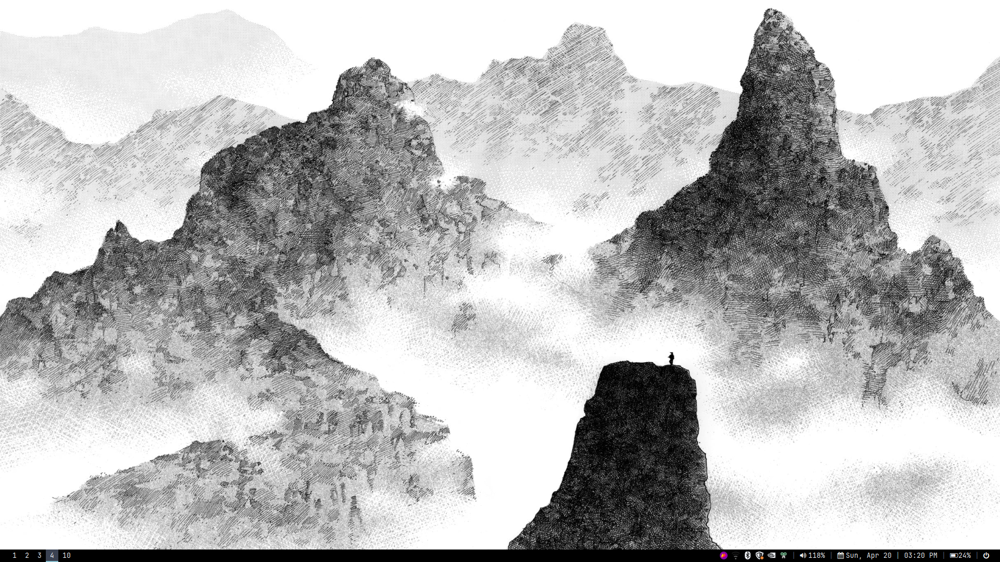

# Dotfiles

A collection of my personal configuration files for various Linux applications and tools.

## Contents

- **alacritty**: Configuration for the Alacritty terminal emulator
- **gtk-3.0**: GTK3 theme and settings
- **i3**: i3 window manager configuration
- **picom**: Compositor configuration for transparency and effects
- **polybar**: Status bar configuration
- **rofi**: Application launcher configuration
- **rofi.jonax**: Custom rofi theme/configuration
- **Thunar**: File manager configuration
- **bashrc**: Bash shell configuration

## Installation

Clone this repository to your preferred location:

```bash
git clone https://github.com/yourusername/dotfiles.git
```

You can symlink these configuration files to their appropriate locations:

```bash
# Example for linking bashrc
ln -s ~/dotfiles/bashrc ~/.bashrc

# Example for linking a config directory
ln -s ~/dotfiles/alacritty ~/.config/alacritty
```

## Screenshots



## Acknowledgments

- Inspired by various dotfile repositories in the Linux community
- Thanks to all the maintainers of the configured software
